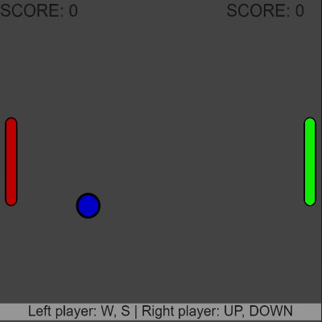

# Pong

My JavaScript implementation of the Pong game using p5.js

You can play here: https://daviddz7.github.io/pong/

Use `W` and `S` for the left player, and `UP` and `DOWN` for the right player. 
Feel free to adjust the window size, the ball's speed increases with the window width.

